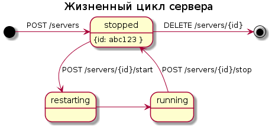

# Менеджер серверов LFS

Данная программа позволяет управлять группой серверов LFS (Live for speed)
запущенных в Docker

Поддерживаемые функции:
 * Создание/удаление севрера
 * Получение списка серверов
 * Проверка состояние сервера
 * Запуск/остановку сервера
 * Редактирование параметров setup.cfg/welcome.txt
 * Обновление версии сервера

<!-- markdown-toc start - Don't edit this section. Run M-x markdown-toc-generate-toc again -->
**Table of Contents**

- [Менеджер серверов LFS](#менеджер-серверов-lfs)
    - [Примеры использования API](#примеры-использования-api)
        - [Серверы LFS](#серверы-lfs)
            - [Получить список серверов](#получить-список-серверов)
            - [Получить информацию об одном сервере](#получить-информацию-об-одном-сервере)
            - [Получить статистику по запущенному серверу](#получить-статистику-по-запущенному-серверу)
            - [Создать сервер](#создать-сервер)
            - [Удалить сервер](#удалить-сервер)
            - [Запустить сервер](#запустить-сервер)
            - [Остановить сервер](#остановить-сервер)
            - [Перезапустить сервер](#перезапустить-сервер)
        - [Управление версиями серверов](#управление-версиями-серверов)
            - [Получить список доступных версий серверов](#получить-список-доступных-версий-серверов)
            - [Залить новую версию (image) сервера](#залить-новую-версию-image-сервера)
    - [Ответ с ошибкой](#ответ-с-ошибкой)
    - [Статусы сервера](#статусы-сервера)
    - [Установка сервера на CentOS 7](#установка-сервера-на-centos-7)
        - [Установка docker и php](#установка-docker-и-php)
        - [Настройка nginx и php-fpm](#настройка-nginx-и-php-fpm)
        - [Развертывание кода](#развертывание-кода)
    - [Решение проблем](#решение-проблем)
        - [Ошибка Docker-а 500](#ошибка-docker-а-500)
        - [Ошибка Docker-а при удалении контейнера](#ошибка-docker-а-при-удалении-контейнера)

<!-- markdown-toc end -->

## Примеры использования API
### Серверы LFS

#### Получить список серверов

Запрос:

``` http
GET http://localhost:8080/servers
```

Ответ:

``` http
HTTP/1.1 200 OK

[
    {
        "id": "34c8fb2b5c07"
        "state": "running",
    },
    {
        "id": "34p8so2o5p07"
        "state": "running",
    }
]
```


Параметры ответа:

 * id - Идентификатор сервера
 * state - Состояние сервера. Возможны следующие значения:
    * `running` - запущен
    * `restarting` - в процессе запуска (перезапуска)
    * `stopped` - остановлен

#### Получить информацию об одном сервере

Запрос:

``` http
GET http://localhost:8080/servers/34c8fb2b5c07
```

Ответ:

``` http
HTTP/1.1 200 OK

{
    "id": "34c8fb2b5c07",
    "state": "running"
}
```

Параметры ответа: такие же как и в списке серверов.

#### Получить статистику по запущенному серверу


Запрос:


``` http
GET http://localhost:8080/servers/34c8fb2b5c07/stats
```


Ответ:

``` http
HTTP/1.1 200 OK

{
  "lfs": "0.6M",
  "status": "online",
  "guests": "0",
  "maxguests": "38",
  "host": "^5LSN ^0EVENTS PRACTICE",
  "pass": "secret",
  "usemaster": "yes",
  "trackcfg": "AU4",
  "cars": "00100000001000000000",
  "qual": "0",
  "laps": "1",
  "conn": "^0EVENTS ^3PRACTICE"
}
```

#### Создать сервер

Запрос:


``` http
POST http://localhost:8080/servers
Content-Type: application/json
{
  "image": "0.6M",
  "carsmax": "38",
  "carsguest": "1",
  "pps": "6",
  "qual": "1",
  "wind": "0",
  "vote": "no",
  "usemaster": "yes",
  "select": "no",
  "start": "",
  "autosave": "",
  "port": "6550",
  "host": "test lsn server",
  "pass": "1234",
  "admin": "123456",
  "mode": "s3",
  "track": "FE2",
  "cars": "ALL",
  "maxguests": "38",
  "adminslots": "8",
  "laps": "1",
  "autokick": "no",
  "rstmin": "",
  "rstend": "",
  "midrace": "",
  "mustpit": "",
  "canreset": "yes",
  "fcv": "",
  "cruise": "yes",
  "player": "test lsn server",
  "welcome": "Hey! \nThis is test server"
  "tracks": ["FE2", "FE3"],
}
```

Ответ:

``` http
HTTP/1.1 201 OK

{
  "id": "34c8fb2b5c07"
}
```

Параметры запроса :

Большинство параметров передаются в неизменном виде в setup.cfg

 * port - номер порта (Обязательный)
 * version - номер Версии
 * host
 * pass
 * admin
 * mode
 * usemaster
 * track
 * cars
 * maxguests
 * adminslots
 * carsmax
 * carsguest
 * pps
 * qual
 * laps
 * wind
 * vote
 * select
 * autokick
 * rstmin
 * rstend
 * midrace
 * mustpit
 * canreset
 * fcv
 * cruise
 * start
 * player
 * tracks - string[] - список возможных трас на сервере. Например:  \['AU1', 'AU1x'\]
 * welcome - string Строка приветсвия на сервера (Можно использовать переносы строк `\n`)
 * autosave

#### Удалить сервер

Запрос:

``` http
DELETE http://localhost:8080/servers/34c8fb2b5c07
```

Ответ:

``` http
HTTP/1.1 204 No Content
```

#### Запустить сервер

Запрос:

``` http
POST http://localhost:8080/servers/34c8fb2b5c07/start
```

Ответ:

``` http
HTTP/1.1 202 OK
```

#### Остановить сервер

Запрос:

``` http
POST http://localhost:8080/servers/34c8fb2b5c07/stop
```

Ответ:

``` http
HTTP/1.1 202 OK
```

#### Перезапустить сервер

Запрос:

``` http
POST http://localhost:8080/servers/34c8fb2b5c07/restart
```

Ответ:

``` http
HTTP/1.1 202 OK
```

### Управление версиями серверов

#### Получить список доступных версий серверов

Запрос:

``` http
GET http://localhost:8080/server-images
```

Ответ:

``` http
HTTP/1.1 200 OK
Content-Type: application/json

[
    {
      "id": "34c8fb2b5c07",
      "name": "0.6Q"
    },
    {
      "id": "14c8fb2b5c07",
      "name": "0.6M"
    }
]

```

#### Залить новую версию (image) сервера

Для добавления новой версии сервера необходимо скачать с сайта LFS архив с выделенным сервером и передать его в API.

В архиве обязательно должен находится файл DCon.exe
Поддерживается zip и tgz архивы.

Запрос:

``` http
POST http://localhost:8080/server-images/0.6m
Content-Type: application/zip

...<zip file archive>...
```

Ответ:

``` http
HTTP/1.1 200 OK
```

Для заливки новой версии сервера необходимо передать архив с содержимым папки
выделенного сервера. Т.е. внутри tgz файла должны быть файлы DCon.exe, а также
папка data с файлами сервера LFS.

Операция создания сервера может занять несколько минут. Ответ на запрос будет
получен только при завершении билда или ошибке.

## Ответ с ошибкой

Запрос:

``` http
DELETE http://localhost:8080/servers/34c8fb2b5c07
```

Ответ:

``` http
HTTP/1.1 409 Conflict
Content-Type: application/json

{
    "error": 409,
    "message": "Server should be stopped prior to deleting"
}
```


## Статусы сервера




## Установка сервера на CentOS 7

### Установка docker и php

TODO: проверить и дописать установку

    # as root
    tee /etc/yum.repos.d/docker.repo <<-'EOF'
    [dockerrepo]
    name=Docker Repository
    baseurl=https://yum.dockerproject.org/repo/main/centos/7/
    enabled=1
    gpgcheck=1
    gpgkey=https://yum.dockerproject.org/gpg
    EOF

    #php stuff
    rpm -Uvh https://dl.fedoraproject.org/pub/epel/epel-release-latest-7.noarch.rpm
    rpm -Uvh https://mirror.webtatic.com/yum/el7/webtatic-release.rpm 
    yum install -y php56w php56w-fpm php56w-opcache
    
    
    yum install -y docker-engine epel-release git
    yum install -y python-pip
    yum upgrade python*
    pip install docker-compose 
    pip install backports.ssl_match_hostname --upgrade
    pip install --upgrade pip
    systemctl enable docker
    systemctl start docker
    groupadd docker
    
    # Create dedicated user for api
    useradd docker-api -U -n -G docker
    
    # as your user
    sudo usermod -aG docker $USER
    sudo systemctl enable docker
    ssh-keyscan -t rsa github.com > ~/.ssh/known_hosts


### Настройка nginx и php-fpm

Путь к проекту `/opt/lfsadmin/current/public`
php-fpm слушает на порту 9001

/etc/nginx/nginx.conf:

``` nginx
...

# Docker-API server
server {
    listen 8080 default_server;
    listen [::]:8080 default_server;


    root /opt/lfsadmin/current/public;

    index index.html index.php;

    location / {
        try_files $uri /index.php;
    }

    # pass the PHP scripts to FastCGI server listening on 127.0.0.1:9000
    #
    location ~ \.php$ {
        fastcgi_pass   127.0.0.1:9001;
        fastcgi_index  index.php;
        fastcgi_param  SCRIPT_FILENAME  $document_root$fastcgi_script_name;
        include        fastcgi_params;
    }
}
```


/etc/php-fpm.d/lfsapi.conf:

    listen = 127.0.0.1:9001
    listen.allowed_clients = 127.0.0.1
    user = lfsadmin
    group = lfsadmin
    pm = dynamic
    pm.max_children = 50
    pm.start_servers = 5
    request_terminate_timeout = 300

    php_flag[display_errors] = off
    php_admin_value[error_log] = /opt/lfsadmin/logs/php-error.log
    php_admin_flag[log_errors] = on

    ; Set session path to a directory owned by process user
    php_value[max_execution_time] = 300
    php_value[session.save_handler] = files
    php_value[session.save_path]    = /opt/lfsadmin/session
    php_value[soap.wsdl_cache_dir]  = /opt/lfsadmin/wsdlcache

### Развертывание кода

 * Установить [deployer](https://deployer.org/)
 * На удаленном сервере добавить права юзеру под которым идет развертка в `/etc/sudoers`:
  
      Defaults:lfsadmin !requiretty

      lfsadmin ALL=NOPASSWD:/bin/systemctl restart php-fpm.service
  
 * В корне проекта настроить файл экспорта `deploy.yml` по примеру
   `deploy.example.yml`'. Более подробная информация [здесь](https://deployer.org/docs/servers)
 * Перейти в директорию проекта и выполнить:

    dep deploy

## Решение проблем

### Ошибка Docker-а 500

Посмотреть подробнее ошибку можно тут:

    sudo journalctl -u docker
    
### Ошибка Docker-а при удалении контейнера

    Error response from daemon: Driver devicemapper failed to remove root filesystem 19ffd38c2ff6826fcaa1cb0ba626892b7de48dad0812a4457e8412f234dc0979: Device is Busy

[См. также](https://github.com/docker/docker/issues/3823)

Решение: перезапустить докер
